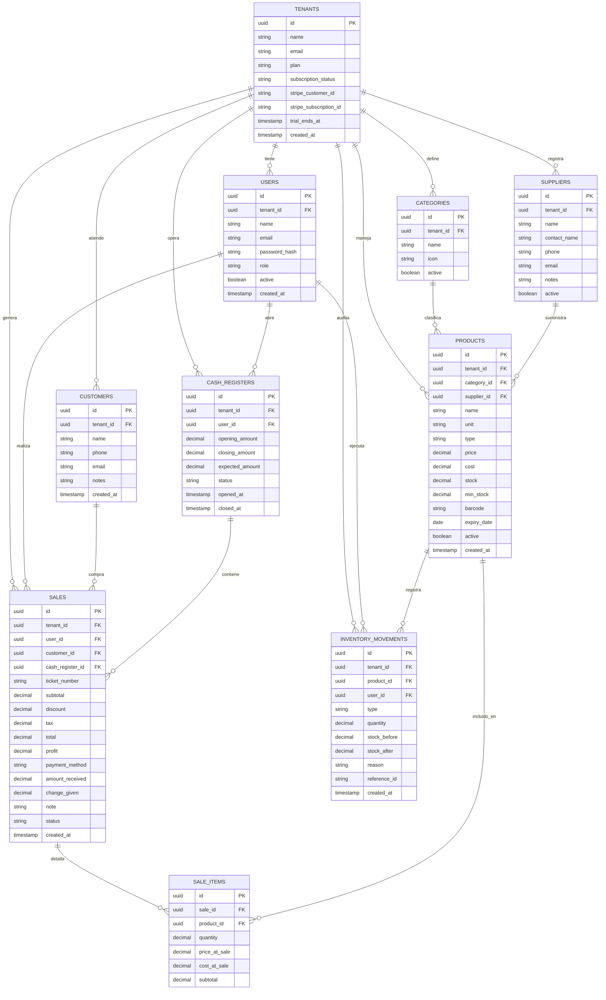

# 🗄️ invLeo — Diagrama Entidad-Relación

Base de datos PostgreSQL · Arquitectura multi-tenant

---

## Leyenda de relaciones

| Símbolo | Significado |
|---|---|
| `\|\|` | Exactamente uno |
| `o{` | Cero o muchos |
| `\|\|--o{` | Uno a muchos |

## Tipos de movimientos de inventario (`type`)

| Valor | Descripción |
|---|---|
| `sale` | Salida por venta |
| `purchase` | Entrada por compra a proveedor |
| `adjustment` | Ajuste manual |
| `waste` | Merma / pérdida |
| `return` | Devolución de cliente |

## Roles de usuario (`role`)

| Valor | Permisos |
|---|---|
| `admin` | Acceso total al negocio |
| `cashier` | Solo POS y consulta de inventario |
| `viewer` | Solo lectura / reportes |

## Estados de suscripción del tenant (`subscription_status`)

| Valor | Descripción |
|---|---|
| `trial` | Período de prueba gratuito |
| `active` | Suscripción activa y pagada |
| `past_due` | Pago fallido, acceso limitado |
| `cancelled` | Suscripción cancelada |
